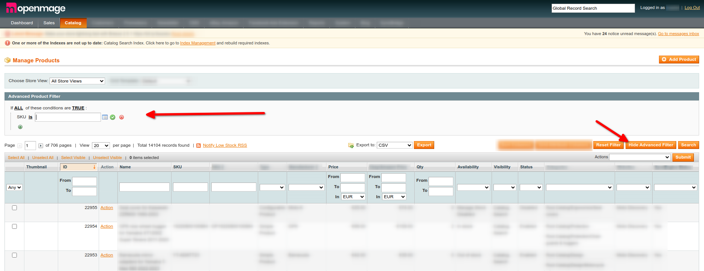

# Advanced Product Filter for OpenMage/Magento Adminhtml

The "Advanced Product Filter" module enhances the OpenMage/Magento Admin product grid with advanced filtering capabilities. It introduces a new button in the **Admin > Catalog > Products grid** that, when clicked, reveals a fieldset. This is similar to promo rules and allows users to filter products using all available product attributes.

## Features

- **Advanced Filtering**: Harness the power of product attributes for more nuanced product search and management.
- **Compatibility**: From our tests, this module is compatible with most plugins available for OpenMage/Magento.
- **Intuitive User Interface**: Adds a new button seamlessly into the product grid for quick access to advanced filters.

## Installation

### Composer

```json
{
    "minimum-stability": "dev",
    "require": {
        "m-michalis/advancedproductfilter": "0.1.*"
    }
}
```

## Usage



1. Navigate to Admin > Catalog > Products.
2. Locate the "Show Advanced Filter" button and click on it.
3. A fieldset similar to promo rules will appear.
4. Use the available product attributes to filter the products as per your requirements.


## Compatibility
- OpenMage 20.0.x
- Magento 1.9.x
- Found to be compatible with most OpenMage/Magento 3rd party plugins (ex. BL_CustomGrid). However, if you encounter any issues, please report them.

## Roadmap & TODOs
- Make this compatible with Related/Upsell/Cross-sell tabs on product edit
- Make this compatible with Catalog > Categories > Manage Category > Category Products
- Make this compatible with custom grids that their collection is `instanceof Mage_Catalog_Model_Resource_Product_Collection` + configuration page for this


## License
This module is released under the GPL-3.0 License.
